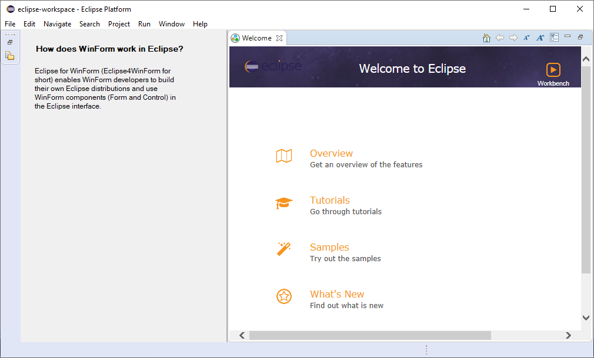
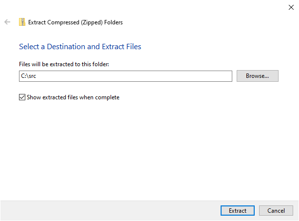
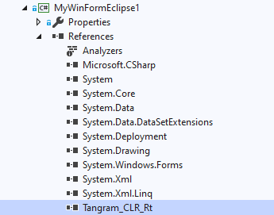
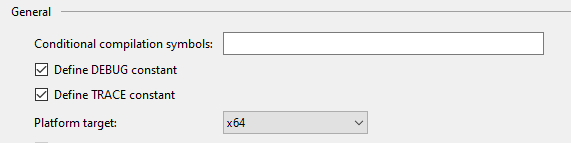
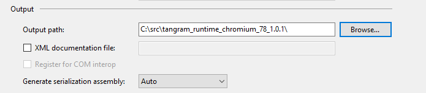
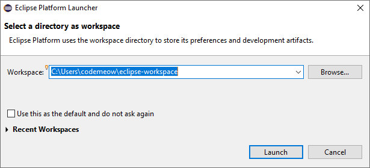
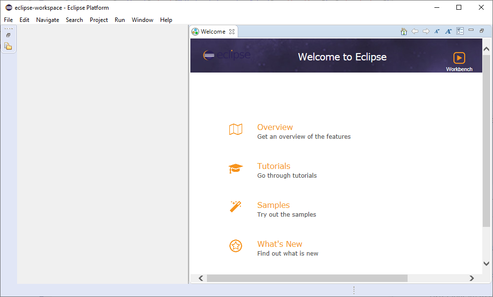
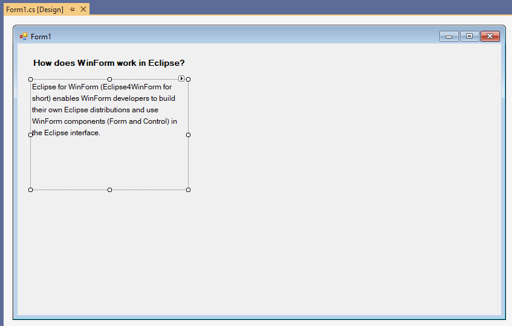

# Eclipse for .NET
Eclipse for .NET is a desktop development framework based on the Eclipse open-source project. The goal of this project is to enable .NET developers to build their own Eclipse distributions using Microsoft.NET desktop technology. In Eclipse for .NET, developers can use WinForm/WPF and Java technologies to build Eclipse interfaces together. There are two editions of Eclipse for .NET, one is open-source and another is commercial. For more information, please visit our GitHub (https://github.com/TangramDev) and our website (https://www.tangram.dev).

## How to work?
Eclipse for .NET enables developers to use Microsoft.NET technology in Eclipse. You can download our [preview package](https://github.com/TangramDev/tangram_runtime_binaries/releases) for experience.

Make sure your computer is Windows 7, Windows 8.1 or Windows 10, and has .NET Framework 4 or later. The Java runtime must be installed. Extract the downloaded preview package to any location and run the demo MyWinFormEclipseN and MyWpfEclipseN. If everything is OK, you will see the following pictures.



WinForm window in Eclipse workbench.

## Get Started
To build your own Eclipse using Eclipse for .NET, you first need a computer with Windows 10 and Visual Studio 2019 installed. The following Visual Studio installation items are essential. 

- .NET desktop development

Also make sure you have the latest version of the Windows SDK and Java runtime installed.

Download [tangram_runtime_chromium_78_X.Y.Z.zip](https://github.com/TangramDev/tangram_runtime_binaries/releases) and extract it to the `C:\src` directory.



Create a WinForm project (.NET Framework) using Visual Studio. And reference to `tangram_clr_rt.dll`(Located at `C:\src\tangram_runtime_chromium_78_X.Y.Z\`).



Change platform target to x64.



Update the Output path to `C:\src\tangram_runtime_chromium_78_X.Y.Z\`.



Use Tangram to take over the WinForm message loop.

```c#
using TangramCLR;

...

static void Main()
{
    Application.EnableVisualStyles();
    Application.SetCompatibleTextRenderingDefault(false);
    Application.Run(Tangram.Context); // !Important
}
```

Build this WinForm program, and the executable file will be generated into the `C:\src\tangram_runtime_chromium_78_X.Y.Z\` directory. Copy the following text as a file into this directory, the file name is `YourExecutableFileName.eclipse`. Note that the `cnnid` in the text needs to correspond to your namespace. 

```xml
<obj type="workbench" objid="MyWinFormEclipse.Form1,host" workbenchkey="foo" showstartup="true" caption="MyWinFormEclipse">
  <window>
    <node id='splitter' name='splitter' rows='1' cols='2' height='250,' width='350,100,' borderwidth='0' splitterwidth='2' middlecolor='RGB(180,180,180)'>
      <node id="clrctrl" cnnid="MyWinFormEclipse.Form1,host"></node>
      <node id="hostview"></node>
    </node>
  </window>
</obj>
```

Then run the program.



Choose a workspace directory and launch.



Form1 has been successfully displayed in Eclipse. Let's make some changes to Form1.



Build and run the WinForm program again.


New changes have appeared in Eclipse.
