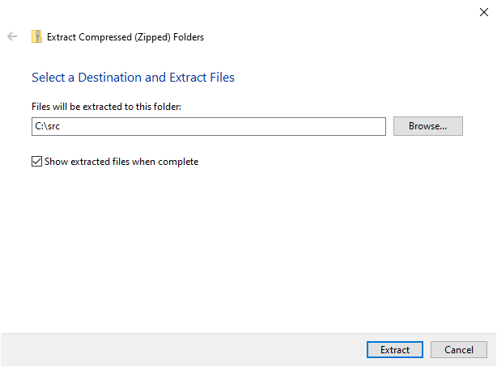
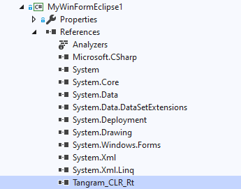

# Eclipse for WPF
Eclipse for WPF is a desktop development framework based on the Eclipse open-source project. The goal of this project is to enable .NET developers to build their own Eclipse distributions using WPF. In Eclipse for WPF, developers can use WPF and Java technologies to build Eclipse interfaces together. There are two editions of Eclipse for WPF, one is open-source and another is commercial. For more information, please visit our GitHub (https://github.com/TangramDev) and our website (https://www.tangram.dev).

## How to work?
Eclipse for WPF enables developers to use WPF in Eclipse. You can download our [preview package](https://github.com/TangramDev/tangram_runtime_binaries/releases) for experience.

Make sure your computer is Windows 7, Windows 8.1 or Windows 10, and has .NET Framework 4 or later. The Java runtime must be installed. Extract the downloaded [preview package](https://github.com/TangramDev/tangram_runtime_binaries/releases) to any location and run the demo MyWpfEclipseN. If everything is OK, you will see the following pictures.


WPF window in Eclipse workbench.

## Get Started
To build your own Eclipse using Eclipse for WPF, you first need a computer with Windows 10 and Visual Studio 2019 installed. The following Visual Studio installation items are essential. 

- .NET desktop development

Also make sure you have the latest version of the Windows SDK and Java runtime installed.

Download [tangram_runtime_chromium_79_eclipse_201909_X.Y.Z.zip](https://github.com/TangramDev/tangram_runtime_binaries/releases) and extract it to the `C:\src` directory.



Create a WPF project (.NET Framework) using Visual Studio. And reference to `tangram_clr_rt.dll`(Located at `C:\src\tangram_runtime_chromium_79_eclipse_201909_X.Y.Z\`).



Change platform target to x64.


Update the Output path to `C:\src\tangram_runtime_chromium_79_eclipse_201909_X.Y.Z\`.


The WPF project does not explicitly include the `Main` function by default. Developers need to delete the `App.xaml` and the `App.xaml.cs` and add a `Program` class file similar to the following:

```c#
using System;
using System.Collections.Generic;
using System.Linq;
using System.Text;
using TangramCLR;

namespace MyWpfBrowser
{
    class Program
    {
        // All WPF applications should execute on a single-threaded apartment (STA) thread
        [STAThread]
        public static void Main()
        {
            WpfApplication app = new WpfApplication();
            app.Run();
        }
    }
}
```

Create a UserControl named UserControl1and add some content.


Add an app.manifest file and uncomment the following paragraphs.


Paragraphs that need to be uncommented.

```xml
  <!-- Enable themes for Windows common controls and dialogs (Windows XP and later) -->
  
  <dependency>
    <dependentAssembly>
      <assemblyIdentity
          type="win32"
          name="Microsoft.Windows.Common-Controls"
          version="6.0.0.0"
          processorArchitecture="*"
          publicKeyToken="6595b64144ccf1df"
          language="*"
        />
    </dependentAssembly>
  </dependency>
```

Build this WPF program, and the executable file will be generated into the `C:\src\tangram_runtime_chromium_79_eclipse_201909_X.Y.Z\` directory. Copy the following text as a file into this directory, the file name is `YourExecutableFileName.eclipse`. Note that the `cnnid` in the text needs to correspond to your namespace. 

```xml
<obj type="workbench" objid="MyWpfEclipse.UserControl1,host" workbenchkey="foo" showstartup="true" caption="MyWpfEclipse">
  <window>
    <node id='splitter' name='splitter' rows='1' cols='2' height='250,' width='350,100,' borderwidth='0' splitterwidth='2' middlecolor='RGB(180,180,180)'>
      <node id="clrctrl" cnnid="MyWpfEclipse.UserControl1,host"></node>
      <node id="hostview"></node>
    </node>
  </window>
</obj>
```

Then run the program.


Choose a workspace directory and launch.


UserControl1 has been successfully displayed in Eclipse.
